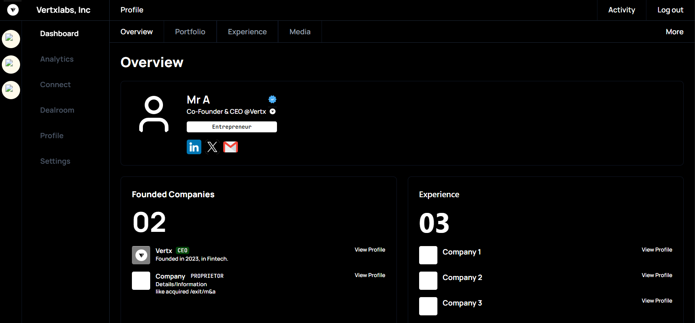

# Vertx Profile UI

A pixel-perfect implementation of the Vertx Profile UI using React.js and Tailwind CSS. This project provides a responsive user interface for a professional profile dashboard with both desktop and mobile layouts.

## Features

- 🖥️ Responsive design that adapts to desktop and mobile screens
- 📱 Mobile-specific layout with fixed header and bottom navigation
- 🎨 Pixel-perfect implementation matching the design specifications
- 🧩 Modular component architecture for better maintainability
- 🔄 Interactive tabs and navigation elements
- 📊 Profile overview with founded companies and experience sections

## Technologies Used

- **React.js** - Frontend library for building user interfaces
- **Tailwind CSS** - Utility-first CSS framework for styling
- **Lucide React** - Icon library for UI elements
